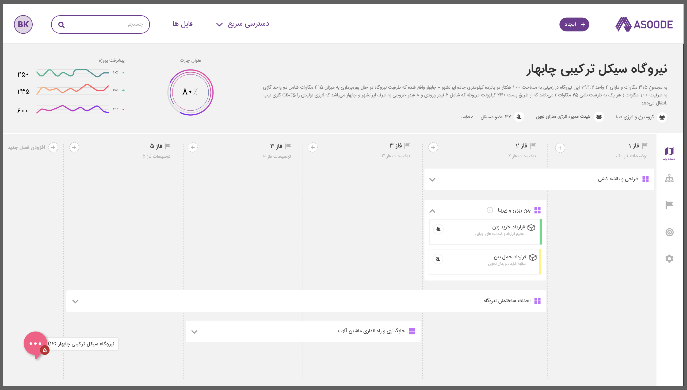
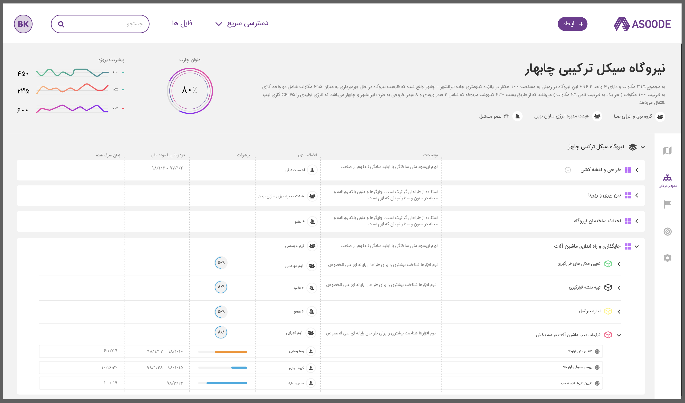
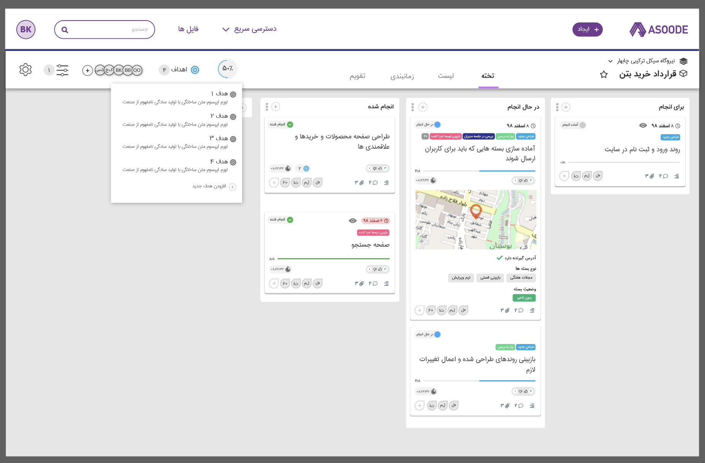
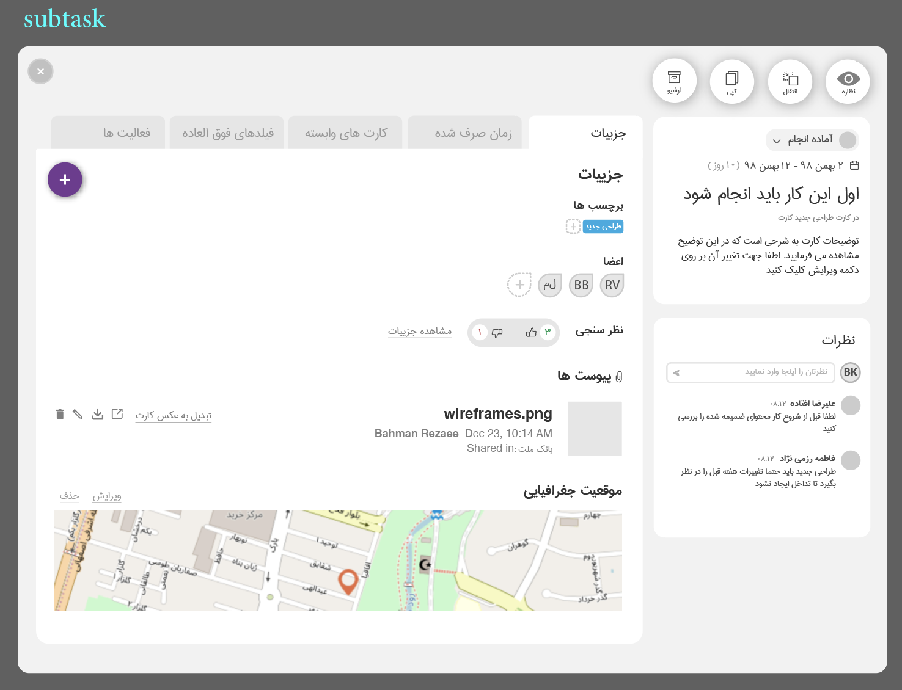
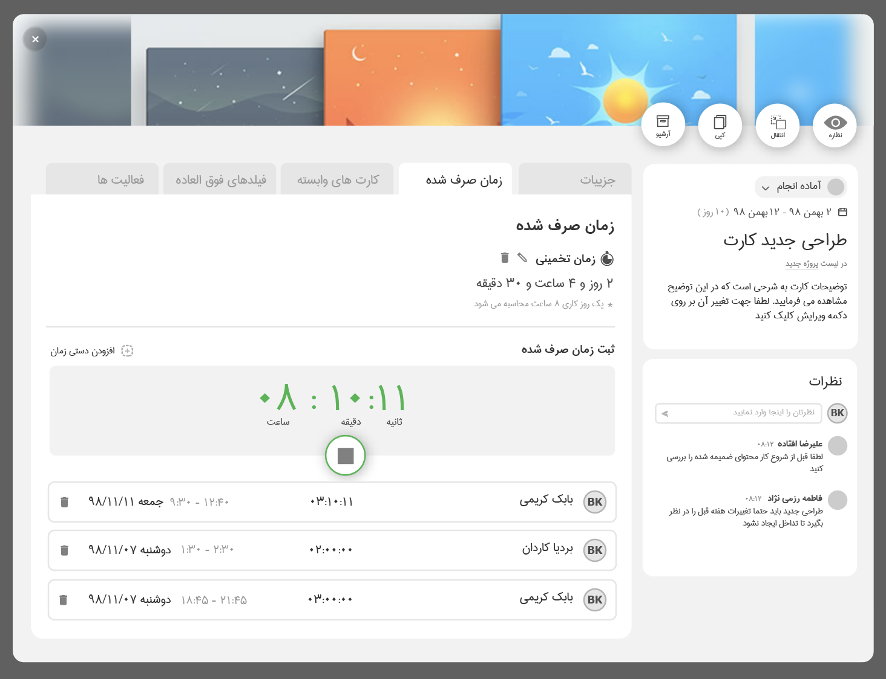
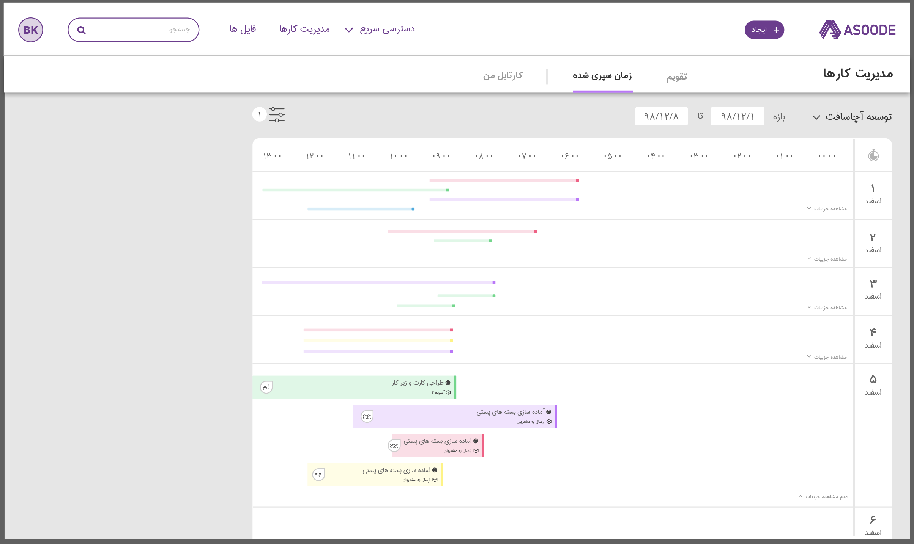
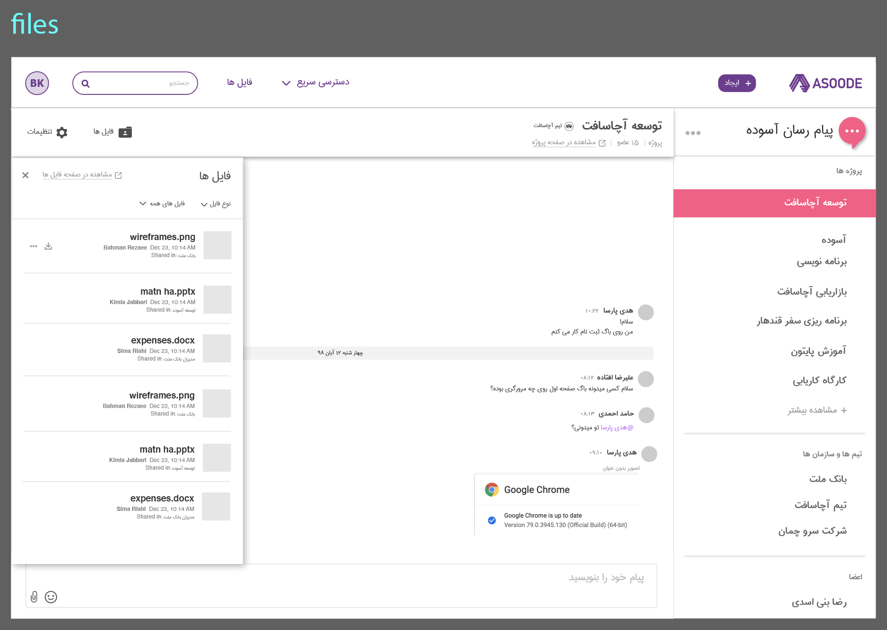
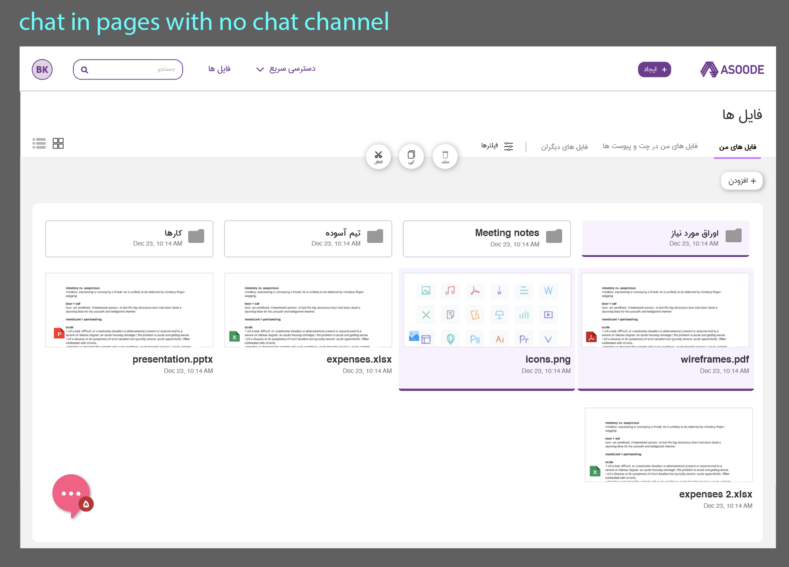
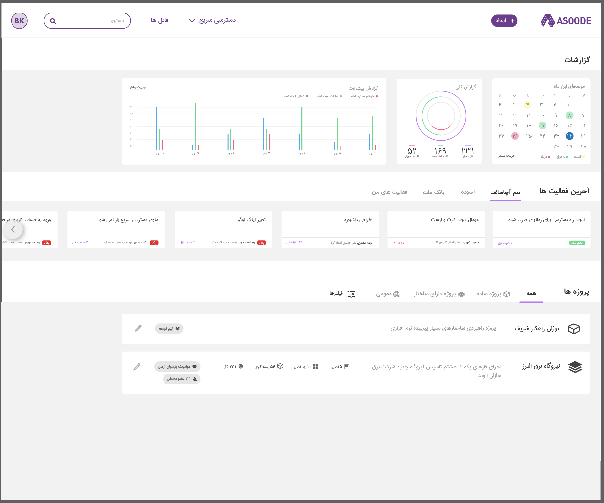

# Asoode - Frontend
## Whats is asoode
asoode is a project management application (was a startup) that got into the sharif university techno park (accelerator) but project was not successful because of improper business plan and it did not get an investor.

 - [Asoode Backend](https://github.com/navid-kianfar/asoode-backend)
 - [Asoode Frontend](https://github.com/navid-kianfar/asoode-frontend)
 - Asoode Socket

#### 06/04/2023
it may take some time to remove the premium restrictions and make every thing available,
but i would appreciate if anyone would want to contribute

## Screenshots & design files
The screenshots are in persian language but application support both RTL & LTR languages,
to internationalization only translating a json file is sufficient

Roadmap

Progress

Boards

Sub Task

Time Tracking

Messenger

File Management

Dashboard

